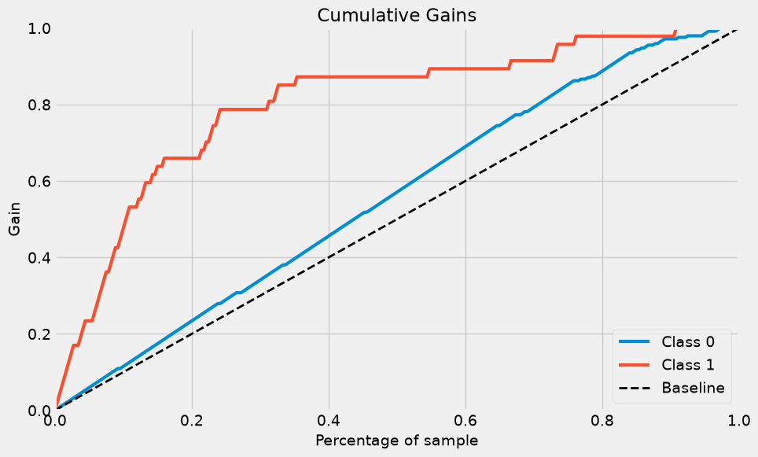
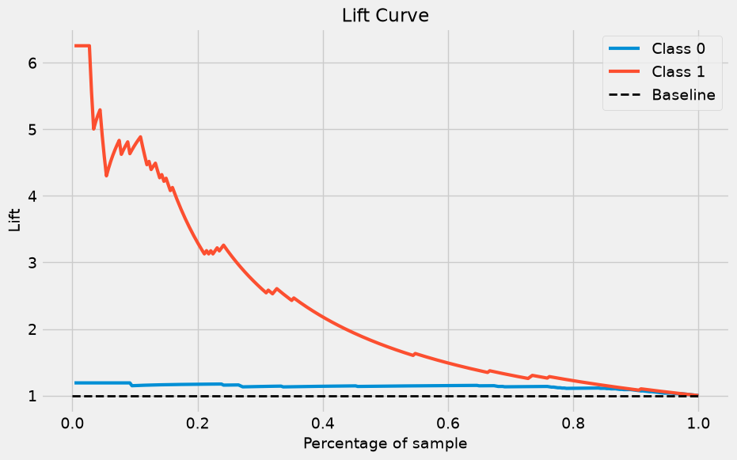
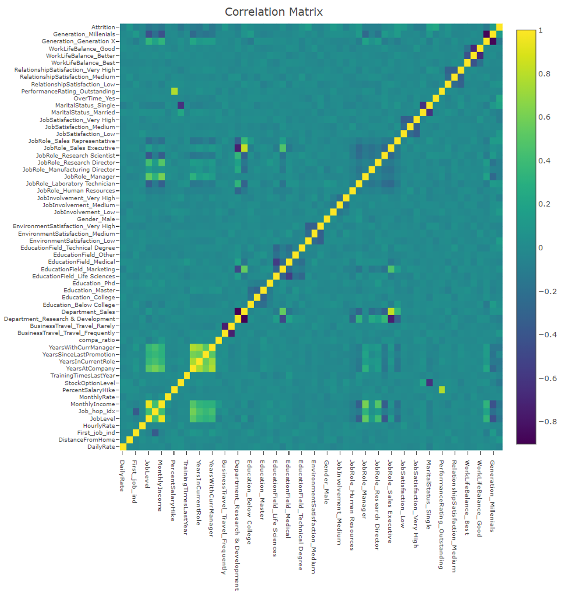
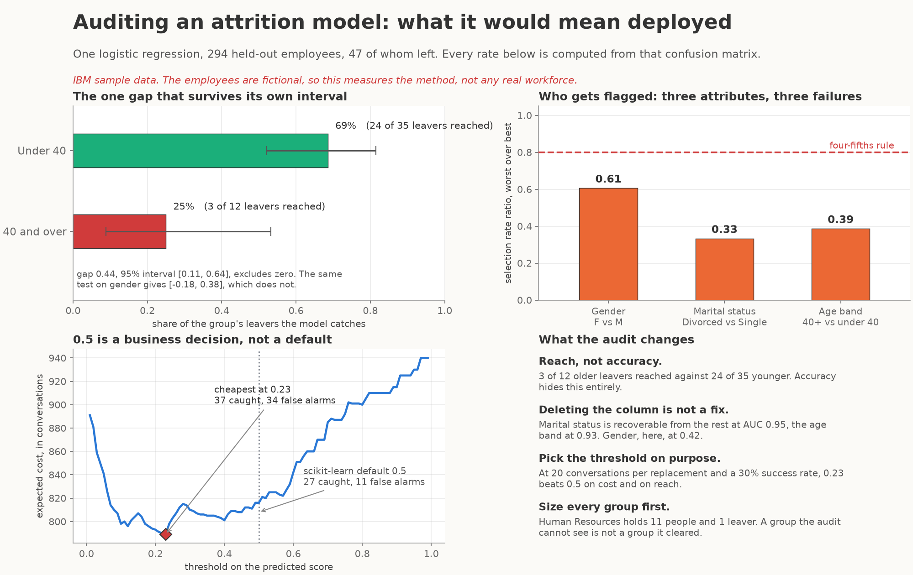
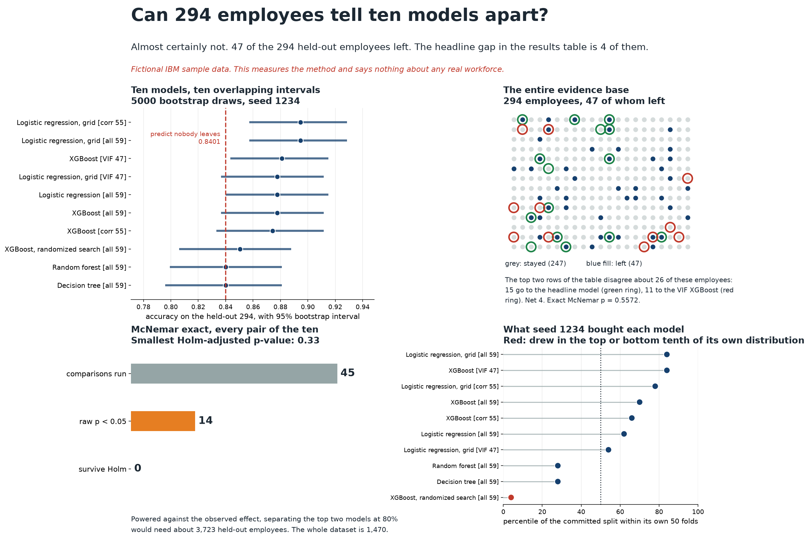

# HR Analytics: predicting employee attrition

<p align="center">
  <a href="#-results">Results</a>&nbsp;&nbsp;·&nbsp;&nbsp;<a href="#-what-the-data-says-about-who-leaves">What it found</a>&nbsp;&nbsp;·&nbsp;&nbsp;<a href="#-auditing-the-model-a-second-notebook">Fairness audit</a>&nbsp;&nbsp;·&nbsp;&nbsp;<a href="#-quickstart">Quickstart</a>&nbsp;&nbsp;·&nbsp;&nbsp;<a href="#-honest-limitations">Limitations</a>&nbsp;&nbsp;·&nbsp;&nbsp;<a href="#-where-the-data-comes-from">Data</a>
</p>

<p align="center">
  <a href="LICENSE"></a>
  <a href="https://www.python.org/"></a>
  <a href="code/"></a>
  <a href="data/SOURCE.md"></a>
  <a href="https://satsawat.ai"></a>
</p>

One notebook that takes IBM's fictional HR sample of 1470 employees, engineers features
from it, trains ten classifiers to predict who leaves, and then does the part most
attrition demos skip: turns the model score into a ranked list an HR team could actually
work down. It is written for anyone who wants to read a complete tabular classification
workflow end to end, from first `describe()` to decile analysis, with the weak parts
labelled rather than hidden.

A [second notebook](code/fairness_audit.ipynb) audits that model. It asks who the model
reaches and who it misses, group by group, and what the answer would cost a business
deploying it. That notebook is a walkthrough rather than a report: it builds every fairness
metric from a confusion matrix by hand, so you can run the same audit on your own model.

Run any of the three notebooks in the browser, which is the only way to see the
interactive plotly charts (GitHub renders them blank):
[main](https://colab.research.google.com/github/netsatsawat/HR-Analytics/blob/master/code/HRM_Employee%20Attrition.ipynb)
· [fairness audit](https://colab.research.google.com/github/netsatsawat/HR-Analytics/blob/master/code/fairness_audit.ipynb)
· [statistical rigour](https://colab.research.google.com/github/netsatsawat/HR-Analytics/blob/master/code/statistical_rigour.ipynb).
Colab does not have the pinned versions, so install them first with
`!pip install -r requirements.txt`.

Companion code for the writing at [satsawat.ai](https://satsawat.ai).


## 🧭 What this is, and what changed in 2026

I published this in May 2019 and left it alone for seven years. Somewhere in that gap it
stopped running. The first import cell asks for `sklearn.metrics.scorer`, which
scikit-learn removed in 0.24, so every clone made after 2020 opened the notebook and got
an `ImportError` before a single row of data loaded. Two `np.bool` references and a dead
plotting dependency were waiting behind it.

It runs again, on pandas 3, numpy 2, scikit-learn 1.9 and xgboost 3.2. The analysis is
the one from 2019: same split, same engineered features, same models, same hyperparameter
grids, same narrative. Where a number moved, it moved because a library changed, and
[the section below](#-ported-from-2019-what-moved-and-why) says exactly which ones and by
how much rather than quietly restating the new figures as if they were always there.

## 📊 Results

Ten models on 294 held-out employees, 47 of whom left. Every figure below comes back
identical on a fresh run. Everything in the table is printed directly by the committed
notebook except two entries: the `ROC-AUC (probs)` column, integrated from the probability
curve each cell plots, and the `predict nobody leaves` row, derived from the test split
itself. The verifier recomputes both, and both are explained under the table.

| model | features | accuracy | precision | recall | F1 | AUC (labels) | ROC-AUC (probs) |
|---|---|---|---|---|---|---|---|
| predict nobody leaves | n/a | 0.8401 | n/a | 0.0000 | 0.0000 | 0.5000 | n/a |
| Decision tree | all 59 | 0.8401 | 0.5000 | 0.1064 | 0.1754 | 0.5431 | 0.7639 |
| Random forest | all 59 | 0.8401 | n/a | 0.0000 | 0.0000 | 0.5000 | 0.8524 |
| XGBoost | all 59 | 0.8776 | 0.7619 | 0.3404 | 0.4706 | 0.6601 | 0.8170 |
| XGBoost | VIF 47 | 0.8810 | 0.7727 | 0.3617 | 0.4928 | 0.6707 | 0.8337 |
| XGBoost | corr 55 | 0.8741 | 0.7778 | 0.2979 | 0.4308 | 0.6408 | 0.8198 |
| XGBoost, randomized search | all 59 | 0.8503 | 0.5455 | 0.3830 | 0.4500 | 0.6611 | 0.8159 |
| Logistic regression | all 59 | 0.8776 | 0.7037 | 0.4043 | 0.5135 | 0.6859 | 0.8570 |
| **Logistic regression, grid search** | **all 59** | **0.8946** | **0.7105** | **0.5745** | **0.6353** | **0.7650** | **0.8620** |
| Logistic regression, grid search | VIF 47 | 0.8776 | 0.6667 | 0.4681 | 0.5500 | 0.7118 | 0.8462 |
| Logistic regression, grid search | corr 55 | 0.8946 | 0.7222 | 0.5532 | 0.6265 | 0.7564 | 0.8565 |

Two notes on the columns, because both matter more than the numbers:

**Read accuracy against 0.8401, not against zero.** 247 of the 294 test employees stayed,
so a model that predicts "nobody leaves" scores 0.8401 without looking at the data. The
decision tree and the random forest land on exactly that line. Only the grid-searched
logistic regressions clear it by a margin worth anything.

**"AUC (labels)" is not ROC-AUC.** The notebook prints `roc_auc_score(y_test, y_pred)` on
hard predicted labels, which is balanced accuracy wearing a borrowed name. That was true
in 2019 and I left the computation alone, but the label misleads, so the last column adds
the conventional ROC-AUC integrated from the probability ROC curve each cell already
plots. The gap between the two columns for the random forest is the clearest lesson in
the table: it ranks employees perfectly respectably (0.8524) and still predicts zero
leavers, because at `max_depth=3` with no class weighting nothing it scores ever crosses
0.5. Its precision is `0/0`.

The best model is a plain logistic regression at `C=100` with `l1_ratio=1.0`, which is
pure l1, chosen by a 5-fold grid search on F1 across all 59 features. It flags 38 of the
294 employees, 27 of whom really left, and misses 20. Confusion matrix, reading TN, FP,
FN, TP: **236, 11, 20, 27**. Simple model, unscaled features, and it beats the tuned
XGBoost by 19 points of F1.

### Ranking beats classifying

The 0.5 cut-off is the least interesting thing you can do with a score. Sorted by
predicted probability and split into deciles:

| decile | score range | employees | leavers | hit rate | share of all leavers caught |
|---|---|---|---|---|---|
| 1st | 0.59 to 0.97 | 30 | 23 | 0.7667 | 0.4894 |
| top 2 | above 0.29 | 59 | 31 | 0.5254 | 0.6596 |
| top 3 | above 0.15 | 88 | 37 | 0.4205 | 0.7872 |

Call the top thirty names on a 294-person list and roughly three in four of them are
genuine flight risks, which is 48.9% of everyone who left. That is the number an HR
partner can plan a week around, and it is a different conversation from "the model is 89%
accurate".





The score band table further down pushes the same idea harder: of the 8 test employees
scored above 0.80, all 8 left. Eight people is an anecdote, not evidence, and the band
table sits in the notebook as an illustration of the workflow rather than as a result.

## 🔍 What the data says about who leaves

The notebook's exploratory section asks four questions and answers them with plots. The
rates below are the same relationships in numbers, computed over all 1470 rows, so you
can check them against the CSV in one line of pandas.

| factor | attrition rate | compared with |
|---|---|---|
| Works overtime | 0.3053 (n=416) | 0.1044 for everyone else (n=1054) |
| Travels frequently | 0.2491 (n=277) | 0.0800 for non-travellers (n=150) |
| Single | 0.2553 (n=470) | 0.1248 married (n=673), 0.1009 divorced (n=327) |
| Worst work life balance | 0.3125 (n=80) | 0.1422 at the most common level (n=893) |
| Lowest job satisfaction | 0.2284 (n=289) | 0.1133 at the highest level (n=459) |
| Lives more than 10km away | 0.2095 (n=444) | 0.1404 for everyone closer (n=1026) |

Median monthly income is 3202 for leavers against 5204 for stayers, and attrition falls
steadily with education, from 0.1824 below college to 0.1042 among the 48 employees at
the highest level. Overtime is the strongest single signal in the exploration and it is
also one of the largest coefficients in the fitted logistic regression, which is a
reassuring but not independent agreement: both are reading the same 1470 rows.

Everything in this section describes a dataset IBM invented. See
[the limitations](#-honest-limitations) before carrying any of it into a meeting.

## ⚡ Quickstart

```bash
git clone https://github.com/netsatsawat/HR-Analytics.git
cd HR-Analytics
python -m venv .venv && source .venv/bin/activate   # Windows: .venv\Scripts\activate
pip install -r requirements.txt
jupyter notebook "code/HRM_Employee Attrition.ipynb"
```

The filename contains a space, so the quotes are load bearing. Two system packages sit
outside pip on macOS:

```bash
brew install libomp     # xgboost imports without it and then fails to load
brew install graphviz   # only needed for the cell that renders the decision tree
```

To run the whole thing headlessly and confirm the numbers above for yourself:

```bash
cd code
jupyter nbconvert --to notebook --execute "HRM_Employee Attrition.ipynb" \
  --output /tmp/hr_run.ipynb --ExecutePreprocessor.timeout=1800
jupyter nbconvert --to notebook --execute fairness_audit.ipynb \
  --output /tmp/fairness_run.ipynb --ExecutePreprocessor.timeout=1800
```

The timeout matters: the slowest cell is a randomized search over 4000 fits, and the
nbconvert default would kill it. The notebook is deterministic: run it twice and the
confusion matrices and metrics come back identical for all ten models, which is what
makes the table above checkable rather than decorative. The audit notebook rebuilds only
the winning model, so it finishes quickly, and it asserts the confusion matrix it is
auditing before it audits anything.

Checking it is one command, and it needs nothing installed:

```bash
python3 scripts/verify_readme_claims.py
```

That script recomputes this README's 2026 figures from the committed notebook and the
committed CSV, then fails if the README and the artifacts disagree. It is the reason you
can read the results table without taking my word for any of it. The 2019 column in the
"what moved" section is quoted from the original run's outputs, which this repository
rewrote, so those are read from git history rather than recomputed.

Versions are pinned in [`requirements.txt`](requirements.txt) and were resolved on Python
3.11.15.

## 🧪 How it works

**Cleaning.** 35 columns in. Three carry a single value for all 1470 rows
(`EmployeeCount`, `Over18`, `StandardHours`) and are dropped, as is `EmployeeNumber`,
which is an identifier. Seven ordinal-coded columns are mapped back to their labels so the
plots read in words.

**Split first, then engineer.** 80/20 with `random_state=1234`, giving 1,176 training and
294 test rows, 190 and 47 leavers respectively. Feature engineering happens after the
split because in production the engineered columns will not exist until the row arrives.
They are generation from age, a first-job flag and a job-hop index from tenure and
employer count, and a compa-ratio against the median income for the same department, role
and level.

**Encoding and three feature sets.** One-hot encoding with `drop_first` gives 59 features.
Those 59 are then pruned two ways, and all three sets are carried through the models: all
59, a VIF-pruned set of 47 at threshold 7, and a correlation-pruned set of 55 at
threshold 0.8, which drops `MonthlyIncome`, `Department_Sales`, `JobRole_Sales Executive`
and `Generation_Millenials`. The two methods disagree, which is the point of running both.



**Models.** Decision tree and random forest at `max_depth=3`, XGBoost at
`learning_rate=0.1, max_depth=3` with 100 trees on each of the three feature sets, a
randomized search over 800 parameter combinations by 5 folds scored on F1, then logistic
regression plain and grid-searched over `C`, `l1_ratio` and class weight on each feature
set. Helper functions for evaluation and plotting live in
[`code/myUtilityFunction.py`](code/myUtilityFunction.py).

## ⚖️ Auditing the model: a second notebook

[`code/fairness_audit.ipynb`](code/fairness_audit.ipynb) asks the question the analysis above
never does. The winning model reads `Gender_Male`, two `MaritalStatus` dummies, two
`Department` dummies and two `Generation` dummies, and `Generation` is age at three-bucket
resolution. Seven of its 59 features describe who somebody is rather than what they do. The
main notebook fits that model, ranks employees by it, and never asks what running it would
mean for the people in the file.

**What it teaches.** A fairness audit built from scratch, with no `fairlearn` and no
`aif360`, because the arithmetic is the teaching content: group representation and base
rates, selection rate and the demographic parity ratio, the four-fifths rule, equal
opportunity, equalised odds, calibration by group, a Wilson interval on every rate and a
Newcombe interval on every gap, and a ten-line test of whether deleting a protected column
actually removes the attribute. Every metric is four integers and a division, taken from a
confusion matrix sliced by group. The second half turns that confusion matrix into money: a
cost model whose three parameters the reader sets, a threshold sweep, and the fairness gap
priced in the same units.

**Who it is for.** A data scientist who can fit a classifier and has never run an audit. No
legal background needed; the one rule with a citation is quoted where it is used. The
notebook holds 59 cells, 32 of them code, executed with outputs committed, and its charts are
plotly and interactive to match the main notebook.

The audit table below is the same model's confusion matrix, sliced. Every rate quoted in this
section is derived from these counts and recomputed by the verifier.

| dimension | group | n | leavers | flagged | tn | fp | fn | tp | selection rate | TPR |
|---|---|---|---|---|---|---|---|---|---|---|
| Gender | Female | 109 | 14 | 10 | 92 | 3 | 7 | 7 | 0.0917 | 0.5000 |
| Gender | Male | 185 | 33 | 28 | 144 | 8 | 13 | 20 | 0.1514 | 0.6061 |
| MaritalStatus | Divorced | 60 | 8 | 4 | 51 | 1 | 5 | 3 | 0.0667 | 0.3750 |
| MaritalStatus | Married | 144 | 18 | 16 | 121 | 5 | 7 | 11 | 0.1111 | 0.6111 |
| MaritalStatus | Single | 90 | 21 | 18 | 64 | 5 | 8 | 13 | 0.2000 | 0.6190 |
| AgeBand | 40 and over | 120 | 12 | 8 | 103 | 5 | 9 | 3 | 0.0667 | 0.2500 |
| AgeBand | Under 40 | 174 | 35 | 30 | 133 | 6 | 11 | 24 | 0.1724 | 0.6857 |
| Department | Human Resources | 11 | 1 | 1 | 10 | 0 | 0 | 1 | 0.0909 | 1.0000 |
| Department | Research & Development | 185 | 24 | 24 | 153 | 8 | 8 | 16 | 0.1297 | 0.6667 |
| Department | Sales | 98 | 22 | 13 | 73 | 3 | 12 | 10 | 0.1327 | 0.4545 |

The age band is cut at 40 because that is the boundary the US Age Discrimination in
Employment Act draws, and because it is the finest cut this test set supports: split four
ways instead and the oldest band holds 2 leavers. Department is audited alongside the three
protected attributes as a contrast, not as a protected class of its own.

**What it concludes.**

**It fails the four-fifths screen on every dimension**, at 0.6062 for gender, 0.3333 for
marital status, 0.3867 for the age band and 0.6853 for department. Most of that is base
rates: single employees and employees under 40 leave at roughly twice the rate of their
comparison groups in this file, and a model that flagged both sides equally would be wrong
about one of them. That is why demographic parity opens an investigation rather than closing
one.

**One gap survives its own confidence interval, and it is age.** The model reaches 24 of the
35 leavers under 40 and 3 of the 12 aged 40 and over: a difference of 0.4357, with a 95%
interval running from 0.1085 to 0.6419. The gender gap is 0.1061 with an interval of -0.1811
to 0.3808 and the marital status gap is 0.2440 with an interval of -0.1382 to 0.5387. Both
contain zero. Two of the three differences the rate table displays are differences this data
cannot support, and the notebook says so rather than reporting all three.

**Deleting a protected column does not delete the attribute.** Fit the remaining features to
the attribute itself and marital status comes back at AUC 0.9505, because every Single
employee in this dataset carries `StockOptionLevel` 0 and a benefits field is therefore a
near-perfect proxy. The age band comes back at 0.9339, and still at 0.6908 once both
`Generation` dummies are dropped, because almost everything an HR system records accumulates
with time. Gender comes back at 0.4196, worse than chance, which is the one attribute here
where removing the column would genuinely remove it. Three attributes, three different
answers, which is why the notebook tests the claim instead of asserting it.

**The 0.5 threshold is a business decision that nobody made.** The notebook defines
`cost_of_replacing`, `cost_of_a_retention_conversation` and `conversation_success_rate` as
parameters the reader sets, and quotes no industry figure for any of them, because there is
no source here for one. Only the ratio matters. At the default threshold the model pays for
itself once one replacement is worth more than 4.6914 conversations, which is
`(27 + 11) / (0.30 x 27)` and nothing else. At 20 conversations per replacement and a 30%
success rate, expected cost is lowest at a threshold of 0.23, catching 37 leavers for 34
false alarms against 27 and 11 at the default. Across a plausible range of those two
parameters the cheapest threshold moves between 0.97 and 0.01, which makes it the largest
lever in the deployment and the one least often discussed.

**The equity failure and the business failure are the same sentence.** At the younger band's
catch rate, 8.23 of the 12 older leavers would have been reached instead of 3. Those are
conversations a company is paying for and not having, with a segment that is older and
longer-tenured than the one it does reach.

The people in this file are fictional, so none of the above is a finding about any real
workforce. It is a demonstration that the method finds one real gap, sizes it, and correctly
declines to call the other two.



## 📐 Can this test set tell the models apart?

[`code/statistical_rigour.ipynb`](code/statistical_rigour.ipynb) turns the same scepticism on
the results table above. That table ranks ten models, and its top two rows are separated by
four employees out of 294. The notebook asks whether that ranking is a result or a reading
of noise, and answers with eight tests.

It is not comfortable reading. McNemar's exact test across all 45 pairs, Holm corrected,
separates no pair from any other: the smallest adjusted p is 0.33. The test set has roughly
a one-in-ten chance of detecting the headline gap even if that gap is real. Every model's
95% accuracy interval is wider than the entire spread of the ten point estimates. Seven of
the ten change rank when the single split is replaced by fifty, and section 1c goes further
still: after correction, not one of the ten is distinguishable from predicting that nobody
leaves.

What survives is ranking rather than labelling. The scores concentrate risk, with 23 of the
top 30 being leavers, and they are calibrated in aggregate. Sorting employees by predicted
risk works. It is the accept-or-reject decision at 0.5 that 47 events cannot defend.



## 🔧 Ported from 2019: what moved and why

Four of the ten models reproduce their 2019 outputs exactly, to the individual cell of the
confusion matrix: decision tree, random forest, and the grid-searched logistic regressions
on the all-features and VIF sets. So does the whole pipeline underneath them. Same
1,176/294 split, same 986/190 and 247/47 class counts, same 59 encoded features, the same
47 columns surviving VIF in the same order, the same four columns dropped by correlation,
and a decile table matching to four decimals. That is the evidence that the port did not
disturb the analysis.

What did move, with the 2019 figure first:

| model | accuracy | F1 | why |
|---|---|---|---|
| XGBoost, all 59 | 0.8707 to 0.8776 | 0.4571 to 0.4706 | xgboost tree-building defaults changed between 0.8x and 3.2 |
| XGBoost, VIF 47 | 0.8776 to 0.8810 | 0.4857 to 0.4928 | same |
| XGBoost, corr 55 | 0.8776 to 0.8741 | 0.4375 to 0.4308 | same, and this one moved down |
| XGBoost, randomized search | 0.8639 to 0.8503 | 0.5000 to 0.4500 | the search picked a different winner, see below |
| Logistic regression, all 59 | 0.8810 to 0.8776 | 0.5570 to 0.5135 | identical hyperparameters, liblinear drift between sklearn 0.20 and 1.9 |
| Logistic regression grid, corr 55 | 0.7857 to 0.8946 | 0.5468 to 0.6265 | the grid flipped on a near tie, see below |

**The tuned XGBoost.** The randomized search now settles on 300 estimators at
`learning_rate=0.1, gamma=0.2, subsample=0.8, colsample_bytree=0.6` instead of 2019's 200
at 0.15, 0.3, 0.7 and 0.8. `max_depth=3` and `min_child_weight=10` are the two settings
both searches agree on. The 2019 combination is still drawn from the same grid under
the same seed, so the search did evaluate it; it simply scores worse in cross-validation
under xgboost 3.2 than the new winner does. The argmax moved because the models
underneath it changed, not because the search did.

**The correlation feature set.** This is the ugly one, and it is worth stating plainly
rather than glossing. The 2019 winner was `C=0.1, l2, class_weight='balanced'`; the 2026
winner is `C=100, l1`, unweighted. In the grid as it now reads, l2 is `l1_ratio=0.0` and
l1 is `l1_ratio=1.0`. The two are separated by 0.0020 in mean cross-validated
F1 (0.5023 against 0.5003, with the 2019 winner now ranked 2nd of the 24 candidates), so
the grid has no real winner on this feature set, and dropping the balanced class
weight is what swings recall from 0.8085 down to 0.5532 while accuracy climbs from 0.7857
to 0.8946. Reported either way, the model selection here rests on a coin flip. The VIF
grid tells a milder version of the same story: it now picks `C=100` where 2019 picked
`C=10`, and lands on identical test metrics.

**One judgement call in the code.** The four `LogisticRegression` constructions now pin
`solver='liblinear'`. In 2019 they ran on scikit-learn's old default, recorded in the
committed output as `solver='warn'`, which was liblinear. The default became lbfgs in
0.22, and lbfgs cannot fit the l1 candidates the grid searches over: each of them would
raise inside `GridSearchCV`, score `NaN`, and be dropped with a warning that
`filterwarnings('ignore')` swallows. The notebook would complete with no error while half
the stated experiment had silently stopped running, which is the same class of breakage as
the import error, not a result changing. With the solver pinned, two of the three grid
searches reproduce 2019 exactly.

**One deprecated parameter retired.** The three grids search `l1_ratio` where they used to
search `penalty`. scikit-learn deprecated `penalty` on `LogisticRegression` in 1.8 and
removes it in 1.10, and `filterwarnings('ignore')` at the top of the notebook would have
swallowed the warning until the removal simply broke the run, which is the same trap the
missing import set seven years ago. Under `solver='liblinear'` the two forms are the same
model: `l1_ratio=1.0` is the old `penalty='l1'`, `l1_ratio=0.0` is `penalty='l2'`. The grid
still has 24 candidates, the search still picks the same one on all three feature sets, and
the fitted coefficients come back identical to the last decimal, so every number in the
results table above is unchanged. This one is a rename with proof, not a result moving.

**One dependency removed.** `scikitplot` has been dead since scipy 1.12 removed
`scipy.interp`. It drew two charts here, the cumulative gain and the lift curve, and both
are now drawn by plain matplotlib functions in `myUtilityFunction.py` with no new
dependency added.

## 🚧 Honest limitations

**The data is fictional.** IBM's data scientists generated these 1470 employees for a
Watson Analytics demo. Nobody in this file resigned from anything. Every relationship in
the notebook is a property of IBM's generator, so no conclusion here is a finding about
any real workforce, including the ones about overtime and income that sound most like
common sense.

**It is small, and the test set is smaller.** 1470 rows, 237 leavers. The held-out set is
294 people containing 47 leavers, so one percentage point of accuracy is roughly three
people and one extra true positive moves recall by 0.02. Treat gaps of a few points in the
results table as noise. Several of them are.

**It is imbalanced, and two models never noticed.** At a 16% positive rate, predicting
"nobody leaves" scores 0.8401. The decision tree and random forest match that and no more;
the random forest predicts zero leavers outright. Both are in the table because deleting
them would make the notebook look better than the experiment was.

**One split, drawn once, not stratified.** No repeated cross-validation on the outer
split, no confidence intervals. Every test number is conditional on `random_state=1234`.

**A feature leaks, mildly.** The compa-ratio uses a median-income lookup built on the full
frame. It is built after the split rather than before, but from the whole dataset, so test
rows contribute to a statistic later applied to test rows. It touches no labels and the
effect is small, but the notebook claims to engineer features after splitting and this one
line does not honour that.

**Real attrition is a survival problem.** This is a static snapshot: features as of one
moment, a binary label, no time dimension, no censoring, no notion of when someone leaves.
An organisation that wants to act needs time to event, not who ever left.

**The score bands are ranks, not calibrated probabilities.** The deciles hold up because
they only require the ordering to be right. The individual bands do not: the top band
holds 8 people.

## 📁 Where the data comes from

`data/WA_Fn-UseC_-HR-Employee-Attrition.csv` is IBM's sample dataset, mirrored on Kaggle,
committed unmodified in May 2019. 1470 rows, 35 columns, 237 leavers, no missing values,
no duplicates.

[`data/SOURCE.md`](data/SOURCE.md) carries the full provenance: the checksum, the row and
column counts recomputed from the committed file, the three constant columns, the class
balance, a short script to verify all of it yourself, and the licensing position (MIT
covers the code in this repository, not IBM's CSV).

## 📦 Layout

```
code/HRM_Employee Attrition.ipynb   the analysis, 97 cells, 54 of them code, outputs committed
code/fairness_audit.ipynb           the fairness and cost audit, 59 cells, 32 of them code
code/myUtilityFunction.py           evaluation, plotting and decile helpers
data/                               the CSV and its provenance note
img/                                figures used by the notebooks and this README
scripts/verify_readme_claims.py     recomputes every number quoted above
requirements.txt                    pinned versions the committed outputs came from
```

## 📄 License

MIT, see [`LICENSE`](LICENSE). The dataset is IBM's and carries its own terms; see
[`data/SOURCE.md`](data/SOURCE.md).

---

Written by [Satsawat Natakarnkitkul](https://satsawat.ai), a data and AI practitioner in
ASEAN. Companion repositories:
[tsfm-bakeoff](https://github.com/netsatsawat/tsfm-bakeoff),
[markov_and_hidden_markov_model](https://github.com/netsatsawat/markov_and_hidden_markov_model),
[agent-failure-lab](https://github.com/netsatsawat/agent-failure-lab). Newsletter:
[AI in Practice](https://satsawat.ai/#newsletter).
